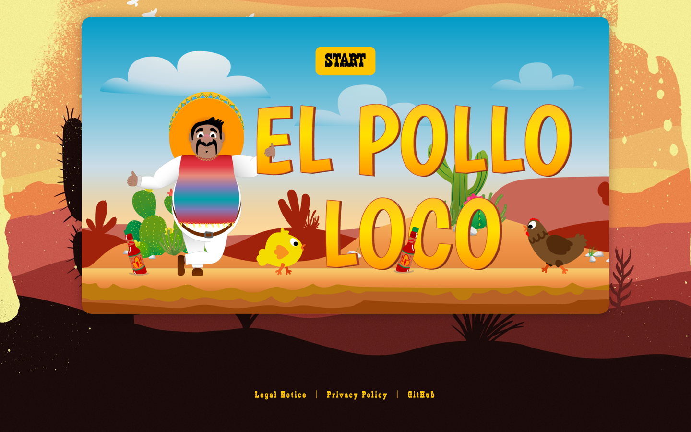
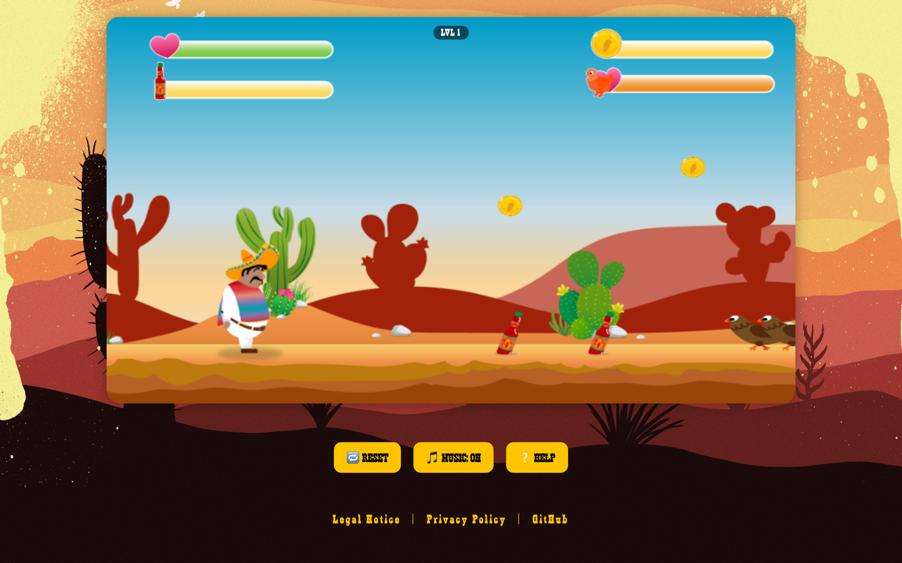

# El Pollo Loco


A 2D jump and run on HTML5 Canvas: Pepe runs through the desert, collects coins and bottles, fights off chickens and takes on the boss at the end.

**Live: [pollo.weskakay.de](https://pollo.weskakay.de)**

## 💡 What is this?

El Pollo Loco is a browser game written in plain JavaScript, drawn frame by frame onto a canvas. No engine, no framework, no build step. Everything on screen is an object with its own image sets, its own animation loop and its own hitbox: Pepe, the chickens, the bottles he throws, the clouds and the layered background.

The structure is where the work sits. Every drawable thing inherits from `DrawableObject`, everything that moves adds `MoveableObject` on top with gravity, hitboxes and animation timing, and only then do the concrete classes appear. The `World` class, which would otherwise become the usual god object, is split into eight files by responsibility: the render pass, the game loop, collisions, collectibles, the throw mechanic, the HUD and the boss are each their own module.

The boss is more than a bigger chicken. It has walking, alert, attack, hurt and dead states, notices Pepe at a distance and switches behaviour accordingly, and carries a health bar that only empties once bottles start landing.

Depth comes from parallax: the background layers move at different speeds against the camera, so the desert has distance without a single line of 3D.

## 📸 Screenshots





## 🎮 Controls

| Action | Key |
|---|---|
| Move right | `→` or `D` |
| Move left | `←` or `A` |
| Jump | `↑` or `W` |
| Throw a bottle | `F` |

On touch devices the on-screen controls appear on their own. Music, reset and help sit as buttons below the canvas.

Works best on a desktop or on a phone held in landscape.

## 🧠 Features

✅ Object oriented architecture with a shared drawable and moveable base
✅ `World` split into eight modules: loop, render, collisions, collectibles, throw, HUD, boss
✅ Animated character with standing, walking, jumping, hurt and dead states
✅ Pepe falls asleep when left alone for a while, with his own sleeping animation
✅ Chickens and small chickens as separate enemy types
✅ Collectible coins and bottles, each with its own status bar
✅ Bottles can be thrown at enemies, with the throw arc handled as its own object
✅ Boss fight with alert, attack, hurt and dead phases and its own health bar
✅ Parallax scrolling across several background layers
✅ Background music and sound effects, switchable at any time, choice remembered between sessions
✅ On-screen controls that appear automatically on touch devices
✅ Help overlay with the controls, reachable during the game
✅ Reset without a page reload
✅ Canvas scales with the viewport
✅ Legal notice and privacy pages

## 🖥️ Tech Stack

| Layer | Technology |
|---|---|
| Language | JavaScript (ES6, no modules, no bundler) |
| Rendering | HTML5 Canvas 2D |
| Architecture | Class hierarchy, `World` split by responsibility |
| Audio | HTML5 Audio through a central sound manager |
| Docs | JSDoc with the Docdash template |
| Backend | none |

## 🚀 Setup

No build step is needed to play. Clone it and serve the folder:

```bash
git clone https://github.com/weskakay/el-pollo-loco.git
cd el-pollo-loco
python3 -m http.server 8000   # then open http://localhost:8000
```

To generate the code documentation:

```bash
npm install
npm run docs
```

The generated output lands in `docs/` and is not committed.

## 📁 Project Structure

```
el-pollo-loco/
├── js/
│   └── game.js                     # Start, reset, music, help, touch controls
├── models/
│   ├── drawable-object.class.js    # Base: image, position, draw
│   ├── moveable-object.class.js    # Gravity, hitboxes, animation timing
│   ├── character.class.js          # Pepe
│   ├── chicken.class.js
│   ├── small-chicken.class.js
│   ├── endboss.class.js            # Alert, attack, hurt, dead
│   ├── bottle.class.js
│   ├── coin.class.js
│   ├── cloud.class.js
│   ├── background-object.class.js
│   ├── throwable-object.class.js
│   ├── keyboard.class.js
│   ├── level.class.js
│   ├── sound-manager.class.js
│   ├── status-bar*.class.js        # Health, bottles, coins, boss
│   └── world/
│       ├── world.class.js          # Composition and setup
│       ├── world.loop.js           # Game loop
│       ├── world.render.js         # Draw pass and camera
│       ├── world.collisions.js
│       ├── world.collectibles.js
│       ├── world.throw.js
│       ├── world.hud.js
│       └── world.endboss.js
├── levels/level1.js                # Enemy, coin, bottle and background placement
├── img/                            # Sprite sheets and backgrounds
├── audio/                          # Music and effects
├── legalNotice.html
├── privacyPolicy.html
└── index.html
```

## 🎨 Design

Warm desert palette, hand drawn sprites, a heavy display typeface for anything the player is meant to click. The canvas sits in a framed panel over a full page background, so the game reads as a screen inside a scene rather than a rectangle on white.

## 📄 License

Private project, published for reference.
